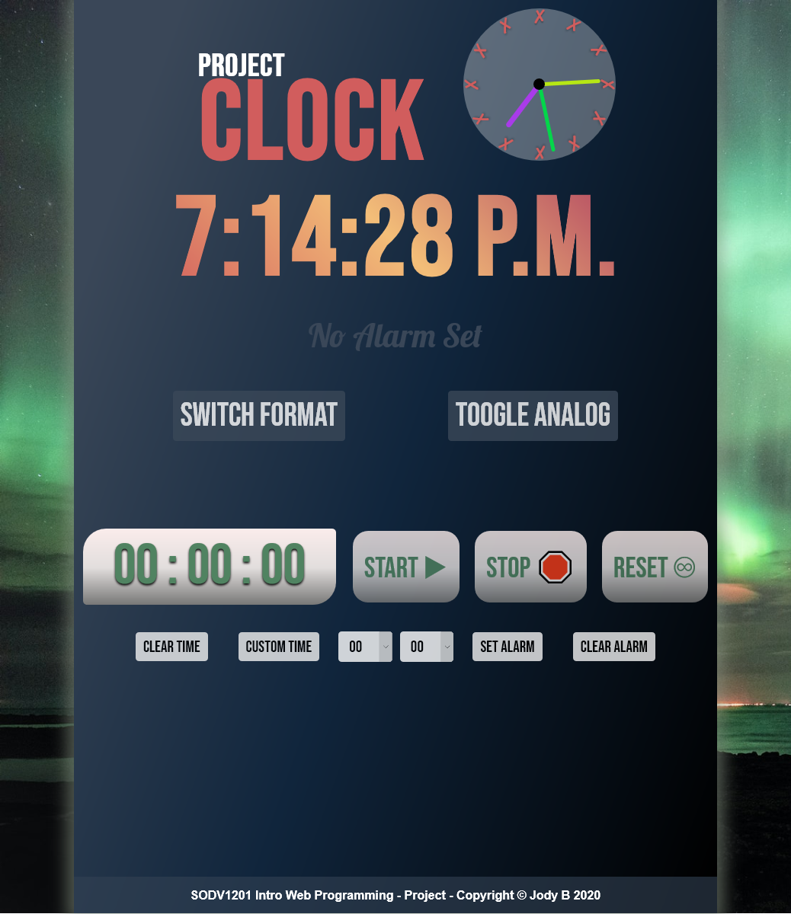
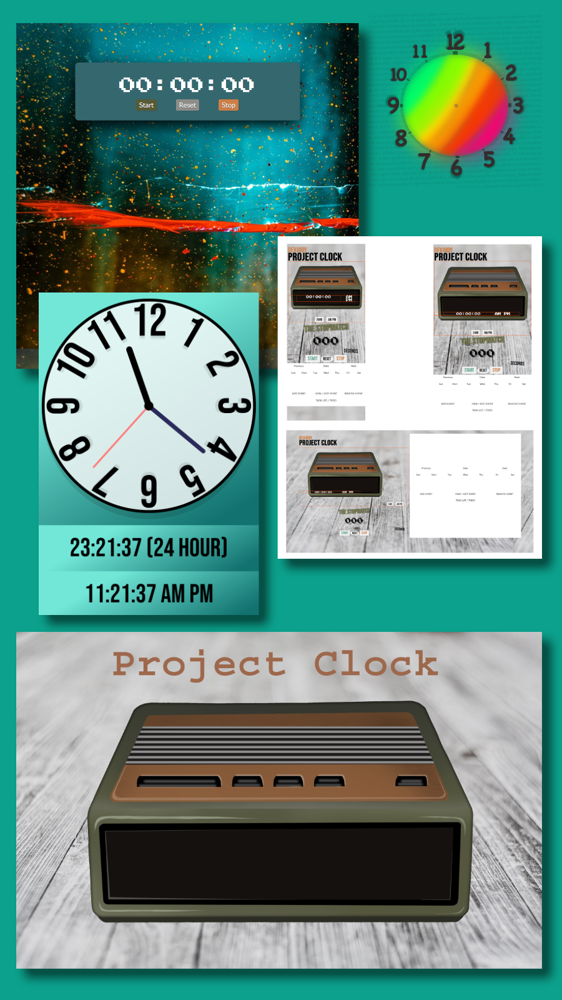

## SODV1201 Intro Web Programming - Project Clock with JS
# [Link to website](https://devjody.github.io/sodv1201_webprog_project_clock/)
- Just to note, the toggle feature isn't running atm and also I have an alarm sound to add in the future! Thank you. 
-----

-----
Here are a couple concepts I played with whilst coding. 
 
